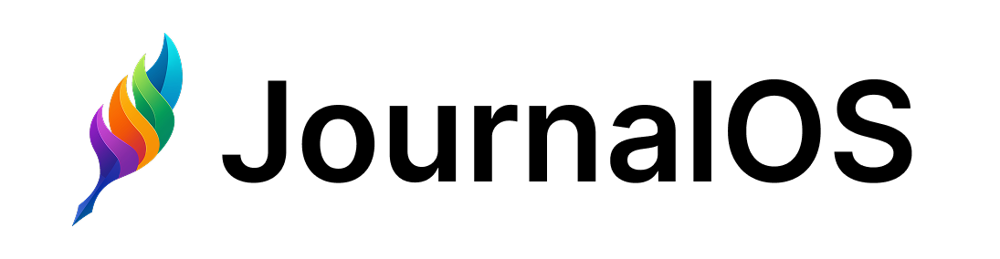
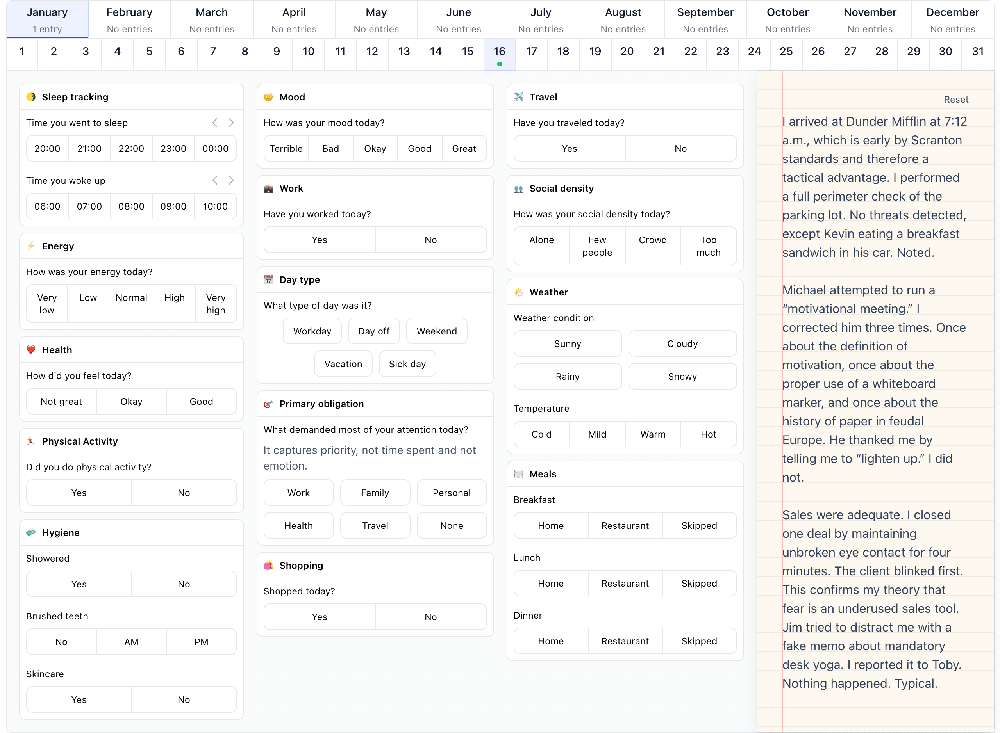

 <picture>
  <source media="(prefers-color-scheme: dark)" srcset="static/logo_github_dark.png">
  
</picture>

<em>Awesome, simple personal diary</em>

  

## What is this?

JournalOS is a simple diary, released under the MIT license. It lets you track your life, like how you slept, if you are in a good mood, if you've worked remotely today, or how many friends you've talked to.

I don't like writing long essays, I've never succeeded in getting into the habit of writing daily. But I still wanted to document my life in a simple and efficient way. Since this didn't exist, I've created something that I would use every day (like [my previous project](https://github.com/monicahq/monica)).

You may use either <a href="https://journalos.cloud">the server I host</a>, or host your own! You can try the product without even having to create your own account.

This is what it looks like.

 <picture>
  <source media="(prefers-color-scheme: dark)" srcset="static/app_github_dark.png">
  
</picture>

### Features

- Daily logging of your life
  

  
💪 Body & Health (5 modules)

  - 🌖 Sleep
  - 🏃‍♂️ Physical activity
  - ❤️ Health
  - 🍽️ Meals
  - 🧼 Hygiene
  

  

  
🧠 Mind & Emotions (2 modules)

  - 🙂 Mood
  - ⚡️ Energy
  

  

  
💼 Work (3 modules)

  - 💼 Work
  - 🎯 Primary obligation
  - 📅 Day type
  

  

  
👥 Social (3 modules)

  - 👥 Social density
  - 🧒 Kids
  - ❤️ Sexual activity
  

  

  
📍 Places (2 modules)

  - ✈️ Travel
  - 🛍️ Shopping
  - 🌦️ Weather
  - 🌬️ Weather influence
  

- Ability to prevent editing older journal entries
- Monthly/yearly statistics
- Random email reminders of what happened in the past
- Fully translated in English and French

### Core principles

- You own your data.
- I work in public.
- I don't assume I know your reality.
- No ads. No reselling of data. I'm like you - hating marketing.

### User and developer principles

I wanted this tool to follow those principles:

- It is very simple to use, without needing a help center, although this exists.
- It is as fast as possible.
- It does not use JavaScript frameworks for the frontend. We use JS to enhance the user experience, but the core is still server-side rendered.
- It should have as few dependencies as possible, since dependencies always create problems.
- The code should be simple and predictable.
- It's designed to be self-hosted.
- The data is fully encrypted at rest. This comes with severe drawbacks, but at least data is secure.

## Note for developers who want to contribute

This project uses the following languages:

- Laravel,
- CSS with [Tailwind](https://tailwindcss.com/) almost exclusively,
- [Blade](https://laravel.com/docs/master/blade) for the templating language,
- JavaScript with [AlpineJS](https://alpinejs.dev/),
- Ajax-like behavior with [Alpine Ajax](https://alpine-ajax.js.org/) and [Turbo](https://turbo.hotwired.dev/),
- PHPUnit for the tests.

These are simple languages, chosen on purpose. They lower the barriers to entry for newcomers who want to help with the project. They are very easy to debug, very easy to install on any machine and very light in terms of resources. I just love the simplicity of code rendered by the backend. Super simple to deliver, super simple to scale.

I believe this project is a good project to learn how to code and to contribute to an open source project.

## Changelog

Please see [CHANGELOG](CHANGELOG.md) for more information on what has changed recently.

## Contributing

Please see [CONTRIBUTING](CONTRIBUTING.md) for details.

## Security Vulnerabilities

Please review [our security policy](../../security/policy) on how to report security vulnerabilities.

## Credits

- [Regis Freyd](https://github.com/djaiss)

## License

The MIT License (MIT), also what I like to call it: the Don't be a dick/don't sue me policy. Please see [License File](LICENSE.md) for more information.
